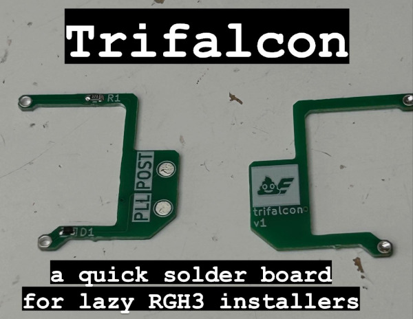
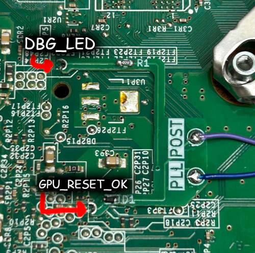

# trifalcon: Yet another RGH3 quick solder board for phats

I got lazy and wanted to mod phats faster. Here is the proof of that.

## Before you install: a word about RGH3 on phats

RGH3 will never work as well on phats as it does on slims. RGH works by slowing down the CPU, and then
sending a precisely timed malformed reset pulse to put the CPU in an unstable state such that it breaks
the secure boot chain of trust. The CGPU on slims can be slowed down far more precisely than the Loki CPU
on phats, so it's harder to get consistent results on phat consoles as a result.

RGH3 at least attempts to compensate for timing inaccuracies. Per 15432's writeup, RGH3 uses a combination
of HANA I2C slowdown and PLL slowdown to glitch the CPU more precisely. It is also possible to overclock the
SMC on these systems to further increase glitching precision.

That said, here are recommendations from a someone who's modded a bunch of 360s.

- **Falcon**: Easiest phats to glitch, and as such are friendliest towards RGH3.
  Falcons are slow to boot anyway, so you can't really tell the difference between RGH1.2
  and RGH3.
- **Jasper and Kronos/Tonkaset**: Wildly inconsistent. With RGH1.2 these boards tend to boot
  either extremely fast or completely randomly. As such, RGH3 is affected by Jasper-related
  headaches, including slow boot times or the system randomly powering off immediately after
  turning it on. Your mileage may vary.
- **Zephyr**: Not really supported even though it has a HANA chip. EXT_CLK is a better bet. 
- **Xenon**: Not supported at all as it doesn't have HANA. Again, use EXT_CLK for these.

## Installation

PCBs should be 0.8mm FR4.

Solder as shown:

The board is designed so that you can trim the gigantic through-holes instead of having to order castellated boards.

## Schematic

Identical to your typical RGH3 job on phats. But that's boring. So, rather than copypaste the usual "22k resistor and a diode" stuff,
let's explain why they're used.

- The 22k resistor on the CPU_PLL_BYPASS line is exactly the same value as the resistor you'd see
  on the Matrix glitcher. CPU_PLL_BYPASS is pulled low by a 10k resistor under the CPU (and also pulled
  low inside the CPU itself, apparently), so this forms a potential divider that converts the 3.3v
  pulses to something closer to 1.03 volts. RGH3 uses an unused debugging LED pin to assert CPU_PLL_BYPASS.

- The pin connected to the diode is actually shared between the CPU POST pin and a GPU "reset done" signal.
  All the diode really does is allow the POST pin to pull the line low safely. Basically any reasonably fast
  switching diode, or even a 1N400x power diode, will work here.

## Further reading

- [15432's writeup on RGH3, its creation, and how it works](https://web.archive.org/web/20250401163119/https://swarm.ptsecurity.com/xbox-360-security-in-details-the-long-way-to-rgh3/)

## License

Public domain